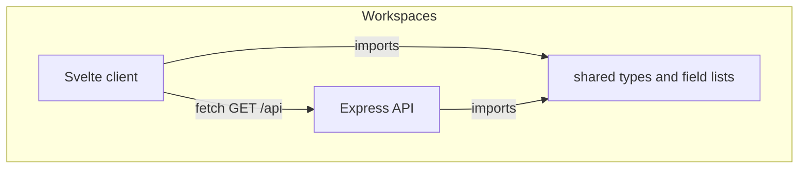
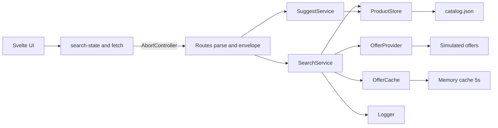
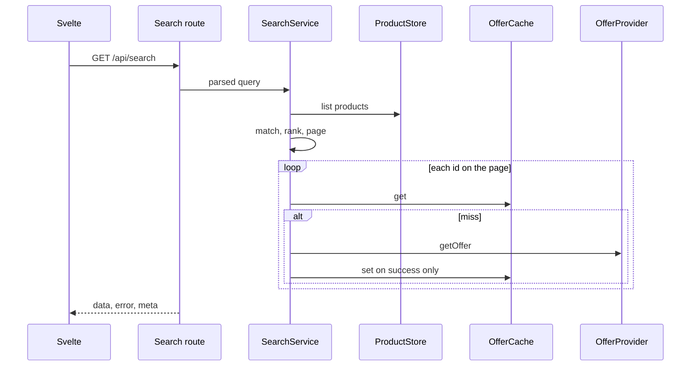
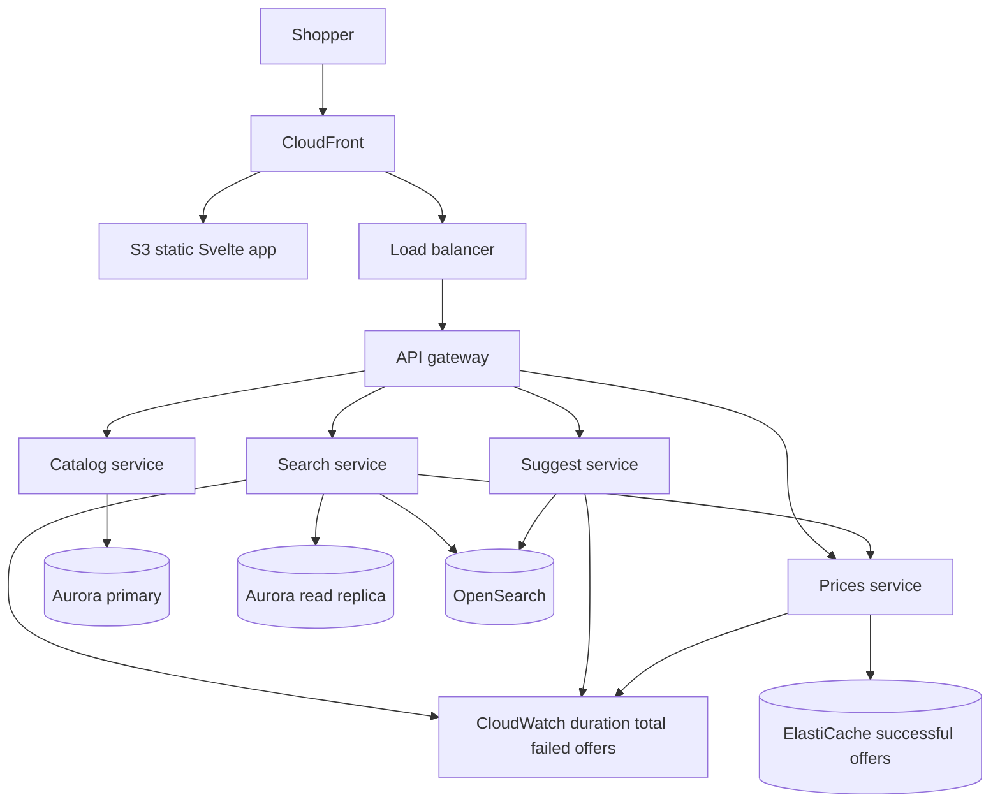

# Solution

This app searches a local catalog of 40 products and shows live
price, availability, and a delivery estimate. The catalog is a
JSON file. There is no database.

## Architecture (today)

Three packages share one contract. The Svelte app talks to
one API. Services depend on ports. `main.ts` wires adapters
by hand.

A search matches the whole catalog, ranks, then pages. Prices
load for the page unless sort is price, which needs live
prices on every match first.

## Design decisions

### JSON catalog

Products and categories live in `server/data/catalog.json`. A
product stores `categoryId`, not the category name. The API reads
the file once at startup. A product change is a file edit and a
restart.

### Ranking

Search matches every product on name and category, ignoring case.
Results are ordered by how close the name fits: exact name, name
starts with the query, name contains the query, then category
name contains the query. Popularity or price only orders products
that match equally well. `id` keeps a page stable when two rows
tie. The count includes every match. The response is one page.

### Suggestions

Suggestions walk spelling distance in layers: exact or contained
names, then one edit, then two edits, and stop at 8 names. A
misspelling such as `buger` or `burgr` offers Burger. The result
list does not change until the person chooses a suggestion.

### Prices

An offer is not stored on the product. After a page is chosen,
the in-process provider is called with each product `id`. The
offer is attached to that same `id` on the card. The server cache
uses that `id` as the key for about 5 seconds. The browser does
not cache prices. A failed lookup leaves the product on the list
with empty offer fields.

### Screen

The screen uses `fetch` and `AbortController` so a new query
cancels the previous request and a search stops at 4 seconds.
Search state lives in one module and is written to the URL. An
empty query browses the catalog, sorted by popularity or price.
The search box strips special characters as you type. The API
still allow-lists `q` before it scans. The list shows loading.
The form stays usable. Each reusable section sits in its own
error boundary so a broken card cannot take down the page.

### Layout and injection

Routes parse the request, call a service, and write the envelope.
Services depend on ports, not on the JSON file. `main.ts` builds
the catalog, the price provider, the memory cache, and the logger,
then passes them into the services by hand. There is no injection
framework. Tests pass fakes of the same ports. A new store, cache,
or price source is a new adapter and one line in `main.ts`.

The repo is three packages: `server`, `client`, and `shared`.
`shared` holds the types both sides use.

## Trade-offs

- **JSON file, no database.** The catalog is 40 products and
  nobody edits it from the screen. Search works as soon as the
  app starts. A product change needs a restart.
- **Search everything, return one page.** "1–10 of 24" includes
  the whole result set, so a better match is not left off the
  first page. The scan of 40 items is cheap. Prices load only
  for the page on screen unless sort is price, which needs live
  prices to order the full set.
- **A closer name ranks above a more popular product.** The item
  someone typed shows up first. A popular item in the same
  category does not jump ahead of a direct name hit.
- **A typo suggests a name and waits for a choice.** The list
  does not silently switch to a different product. Until they
  accept the suggestion, the list can be empty.
- **A missing price does not hide the product.** The card stays.
  A successful price is reused for about 5 seconds, so a repeat
  search is quick. That price can be a few seconds old.
- **The list returns only the fields on the card.** Description
  stays in the file unless the caller names it. A price lookup
  is skipped when the mask has no offer fields.
- **The search is in the address bar.** A copied link restores
  the same query. The URL is longer.
- **One broken card does not take down the page.** That spot
  shows its own error. The person can keep searching.
- **Native `fetch`, not axios.** Three GETs need cancel and a
  4 second timeout. `AbortController` is that job. An HTTP
  client library would add a dependency and not change the
  contract.

## AI assistance

I set the plan and the shape of the repo. Workspaces (`shared`,
`server`, `client`), ports in `main.ts`, the envelope, and
what was out of scope (no database, no create/update/delete)
came from that plan, not from a generated default.

An assistant(Cursor) typed drafts of architecture notes, catalog
rows, services, the Svelte screen, tests, and this file. I
reviewed the diffs against the brief, ran `npm test` and
`npm run build`, and sent work back when it missed a
requirement (empty search as browse, special-character
stripping, failed price vs a card error boundary as two
separate demos etc).

Choices I made, with the option I rejected:

- JSON file at startup, not a database, because 40 products
  and no writes from the screen
- Native `fetch` and `AbortController`, not axios, because
  cancel and a 4 second timeout are the client need
- Hand-wired ports, not a DI framework, because four
  constructors do not need a container
- Rank by name fit, then popularity or price, not
  popularity alone, so a typed name wins
- Suggest and wait for a click, not silent rewrite of the
  result list
- Keep the product when the offer fails, not drop the row
- Scan and page in process now; OpenSearch only if the
  catalog outgrows a full scan

The assistant did not pick those trade-offs. I did, then
checked the running app, the API mask, and the error catalog
against the plan until the requirements were covered.

## System design (not built)

The ports are the swap points. Ranking and the envelope stay.
Static files, many API tasks, and a shared offer cache are the
first scale moves. Catalog, search, suggest, and prices split
only when those workloads need their own limits.

- **S3 + CloudFront** for the client. **Several API tasks**
  behind a load balancer. In-process offer cache would disagree
  across tasks, so successes go to ElastiCache. Failures are
  still not stored. TTL stays short.
- **Writes (later)** clear cached search pages and that
  product's price. Deletes drop the price key. Creates clear
  search pages. The TTL is a backstop if a write is missed.
- **Aurora:** search reads on a replica, catalog writes on the
  primary. Replica lag is acceptable; the screen already
  accepts a price that is a few seconds old.
- **OpenSearch** for name match and typo suggest when a scan
  of every name is too large. The breadth-first walk over 40
  names is the right cost now.
- **Services:** Catalog owns products and categories. Search
  owns match, rank, and page. Suggestions owns the spelling
  walk. Prices owns availability, price, and delivery. The
  screen keeps one fetch module. An HTTP client replaces
  today's in-process port in `main.ts`.
- Categories stay a full list until that list is large. Then
  it pages or searches the same way as products.

Other work that waits: highlighting the matched text, matching
words in any order, and a test that runs the screen in a browser.
